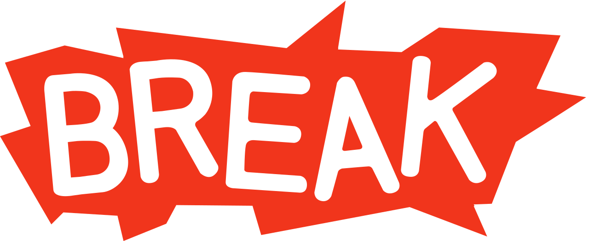

# Break - v1.2

#

## Why you need to use "Break" ?

Break allows you to easily create any type of request to a server. But not only ! It automatically corrects the urls in case of problems and will come to define itself automatically: the url, the type of request and the type of send. Break also allows response backup as well as a responseJSON if possible. Finally, it automatically detects and manages any type of error and sends it back to you in case of problems!
* We can say that Break fully manages your requests and any type of response from the server.

## What is new in v1.2 ?

* Two new system of correction in the URL look at the [[API]](https://github.com/YoannCHB/Break/blob/master/doc/api.md)
* Request become BreakRequest
* break.min.js is here !
* Support port (listen)
* New Command: element.correctURL, element.listen
* Bug setting
* Readme update
* API update

# Support - XMLHttpRequest:
* Send
* POST
* GET
* PORT

# Support - WebSocket:
* CONNECTION
* SEND
* MESSAGES
* PORT

# Support- All:
* Mesage
* Open
* Close
* Error

Command:
---------------------------------------------------------------------
* element.type
* element.json
* element.url
* element.response
* element.send
* element.connected
* element.error
* element.correctURL
* element.listen
* element.method

## Tools:
* [[API]](https://github.com/YoannCHB/Break/blob/master/doc/api.md)
* [[EXAMPLE]](https://yoannchb.github.io/Break/)
